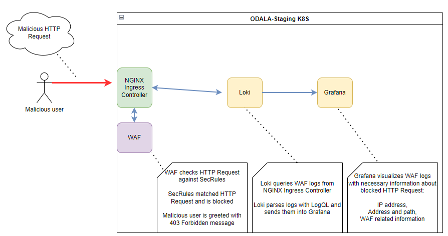
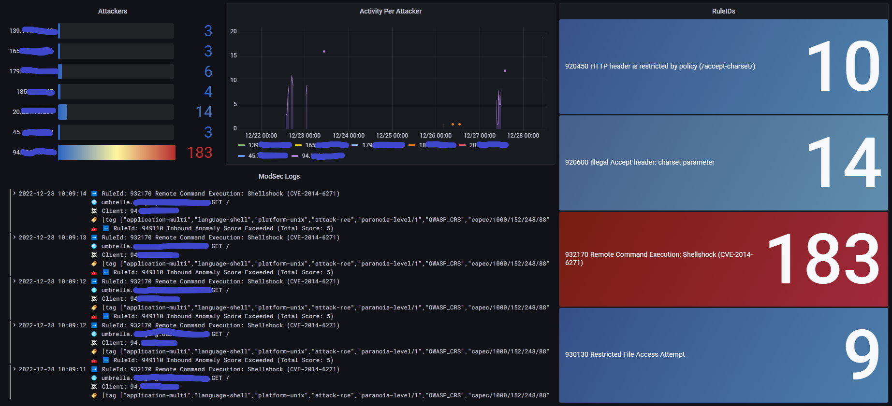
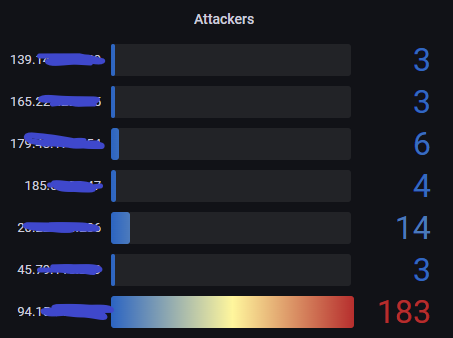
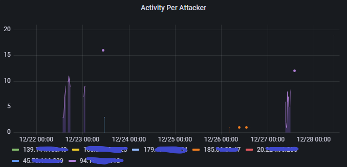
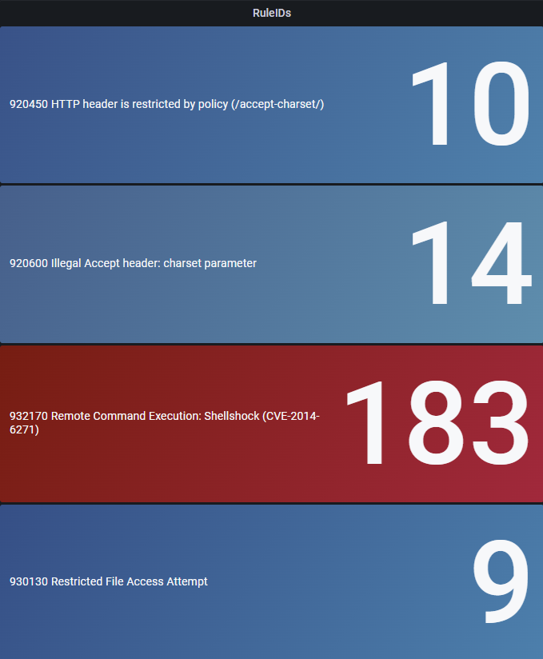
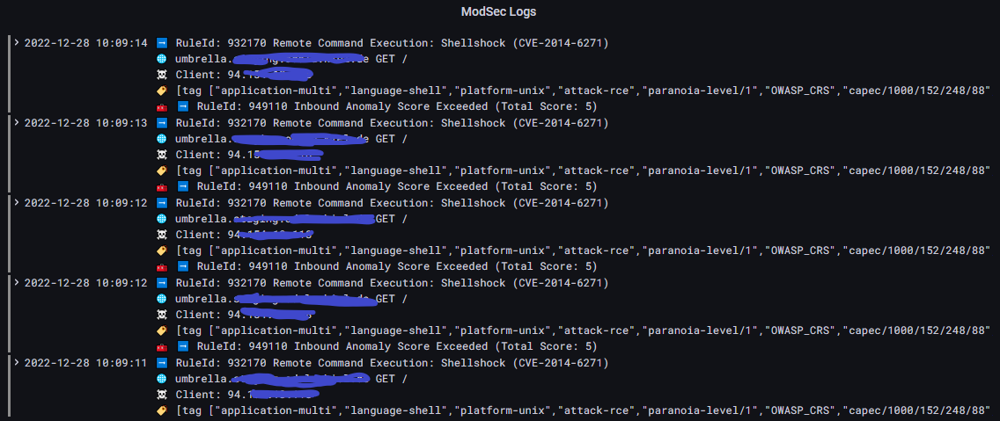
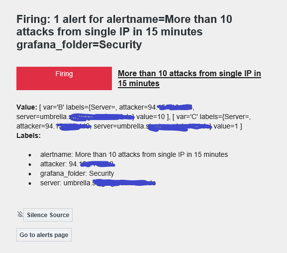
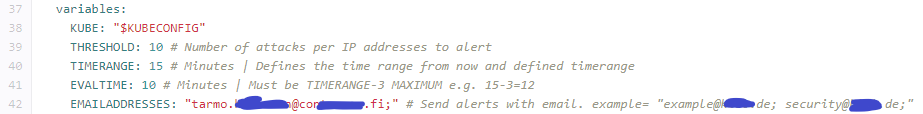

# Web Application Firewall

Web Application Firewall or WAF is needed to secure components from various attacks. WAF solution in ODALA contains Ingress Controller, Grafana, Loki and ModSecurity with OWASP Core Rule Set(CRS). This combination provides open-source WAF component with many possibilities to observe main components' security events and network traffic. 



WAF related components are configured and deployed with Gitlab's CI/CD (Continuous Integration / Continuous Deployment) pipeline tools, meaning that all changes to code are made in Gitlab, not in the Kubernetes Cluster.

---

# Ingress Controller

Ingress Controller is an important component which handles network traffic between internet and other components, like Scorpio Context Broker.

To add internet connectivity for component, Ingress Rule is mandatory to do:

```
apiVersion: networking.k8s.io/v1
kind: Ingress
metadata:
  annotations:
    cert-manager.io/cluster-issuer: letsencrypt-production
    kubernetes.io/ingress.class: nginx
    nginx.ingress.kubernetes.io/proxy-buffer-size: 8k

  name: component
spec:
  rules:
  - host: component.DOMAIN
    http:
      paths:
      - backend:
          service:
            name: component-service
            port:
              number: 5000 # Component's used port
        path: /
        pathType: Prefix
  tls:
  - hosts:
    - component.DOMAIN
    secretName: component-cert
```

As shown in example rule, component is given a subdomain called **component.DOMAIN**, which is using service called **component-service:5000** from Kubernetes Cluster.

The **tls** block is used to ask Ingress Controller to request Let's Encrypt certificates for component to get secured HTTPS connection.

## ModSecurity

ModSecurity is a feature in Kubernetes NGINX Ingress Controller which can be enabled for every component with ModSecurity annotations.

To enable ModSecurity, below are annotations that can be added into Ingress rule. To define new SecRules or modify other functionalities, this can be done with modsecurity-snippet.

```
metadata:
  annotations:
    nginx.ingress.kubernetes.io/enable-modsecurity: "true"
    nginx.ingress.kubernetes.io/enable-owasp-core-rules: "true"
    nginx.ingress.kubernetes.io/modsecurity-snippet: |
      SecRuleEngine On
      SecAuditEngine On
      SecAuditLogFormat JSON
```

Notice that two SecEngines, **SecRule** and **SecAudit** must be enabled. **SecRuleEngine** blocks requests while **SecAuditEngine** provides proper information about blocked requests. **SecAuditLogFormat** produces logs in JSON format.

## Paranoia Level & Anomaly Score

Required security level of component can be adjusted with Paranoia level and Anomaly score. Higher Paranoia level activates more rules from CRS while lower Paranoia level have less rules. Higher Paranoia levels provides more aggressive rules but might cause false positives. If request triggers false positive, it is advised to either lowering Paranoia level or adjusting rules. High Security site needs high Paranoia level but also more work to adjust.

    [ Anomaly Threshold / Paranoia Level Quadrant ]
    
     High Anomaly Limit   |   High Anomaly Limit
     Low Paranoia Level   |   High Paranoia Level
     -> Fresh Site        |   -> Experimental Site
     ---------------------------------------------
     Low Anomaly Limit    |   Low Anomaly Limit
     Low Paranoia Level   |   High Paranoia Level
     -> Standard Site     |   -> High Security Site

Anomaly Score is a sum of triggered SecRules and blocks request if Anomaly Score limit is exceeded. Adjusting Paranoia level might add false positives and testing Paranoia levels (1-4 levels) is recommended to achieve functional component without false positives.

https://coreruleset.org/docs/configuring/paranoia_levels/
-

If false positives occurs, it is possible to handle false positives by adjusting SecRules: removing rule ID, tag or excluding parameters. For example, if component is known to not establishing a connection into database, the SQL related rules can be disabled from that component.

**DO NOT DISABLE ID 949110 rule! DISABLING 949110 disables WAF!**

https://coreruleset.org/docs/configuring/false_positives_tuning/

## SecRule ID 949110 blocking legitimate usage?

If ID 949110 is triggered and logs doesn't tell anything helpful, it means the anomaly score is exceeded by CRS SecRules' default options and therefore blocks the request.

For example, HTTP method PUT request is not allowed by default and ID 949110 is triggered which blocks the PUT request.

To solve this, new SecAction must be added to allow HTTP methods:

    SecAction "id:900000, phase:1, nolog, pass, t:none, setvar:tx.paranoia_level=1, setvar:tx.allowed_methods=GET PUT POST DELETE PATCH HEAD OPTIONS"

Variable **tx.allowed_methods** is overridden with HTTP methods GET, PUT, POST, DELETE, PATCH, HEAD and OPTIONS. If id is already used by another SecAction, try another id.

## Testing ModSecurity

To test functionality of ModSecurity, sending malicious requests is mandatory. It is recommended to send malicious requests from machine where Kubernetes cluster is running.

**NOTE:** when requests are sent and blocked, IP address will be saved in logs and be visible in Security Dashboard, as well might trigger an alert to security team that might execute actions, such as setting a ban to IP address.

Below is a request containing malicious header that utilizes **ShellShock RCE** (Remote Command Execution) vulnerability in bash. Fortunately, vulnerability is old and therefore perfect for testing purposes.

    # ShellShock CVE
    curl -H 'User-Agent: () { :; }; echo' https://umbrella.DOMAIN/cgi-bin/test.sh
    
    <html>
    <head><title>403 Forbidden</title></head>
    <body>
    <center><h1>403 Forbidden</h1></center>
    <hr><center>nginx</center>
    </body>
    </html>

---

# Loki

Loki is made by Grafana and it is used to fetch logs from Ingress Controller.

Retention is enabled and adjusted to delete logs older than 30 days.

https://grafana.com/docs/loki/latest/
-

---

# Grafana

Grafana is a data visualization component that is able to visualize data from different data sources.

In this instance, Grafana is used to query logs from Loki and visualize logs with Security Dashboard's graphs.

## Accessing Grafana

To access Grafana, 

After configuring Putty, running a command **kubectl -n monitoring-system port-forward svc/monitoring-grafana 3000:80** will create a tunnel into grafana service.

Now, Grafana is accessible from http://localhost:3000 - Reader credentials are found at **Gitlab > ODALA group > CI/CD > Variables > SECURITY_COMPONENT_GRAFANA_USER_READ**

## Security Dashboard



Security Dashboard contains useful graphs that visualizes ModSecurity logs.

## Attackers



Attackers graph gathers all logs within time range and separates them with attackers' IP addresses. Attacker graph is useful if attacks are coming from specific IP address and is wanted to be handled further.

## Security Activity



Activity Per Attacker graph shows how long attacker is attacking.

## RuleIDs



RuleIDs graph shows the amount of triggered SecRuleIDs.

## Security Logs



ModSec Logs graph shows the ModSecurity logs in a descending order and contains useful information of log:

* 🌐 Component address with path and method
* ☠️ Attacker's IP address
* ➡️ RuleID with information about attack
* 🏷️ Tags
* 🧰 Debug - used to support administrator if legitimate request is being blocked

Clicking any log shows more information about attack.

## Alerting

Grafana is configured with SMTP so it is possible to get alerts from attacks. 

### Alert Email message

Alert email message contains information about attacks:

* Attacker IP address
* Server that received attacks
* Value contains the amount of attacks in defined timerange



In this example, threshold is set to 10, timerange to 15 minutes and 14 requests blocked in 15 minutes. Threshold being 10 means that Grafana wont be triggered from amount below 10.

### Configuring alerts

Alerts can be configured with Gitlab's CI/CD pipeline. Email addresses, threshold and timerange can be defined.

Explanation of variables:
  * Threshold - Amount of attacks per IP address to trigger the alert
  * Timerange - how far from current time logs are queried



When applying new values into variables and creating a commit, changes will be moved into Kubernetes cluster.

---
